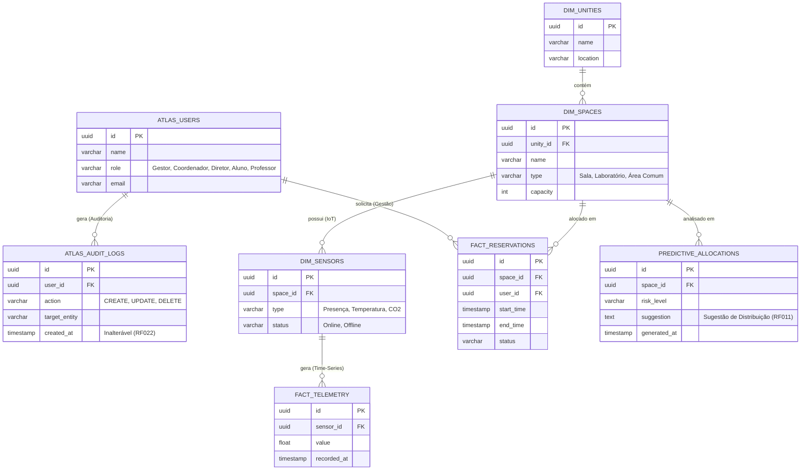
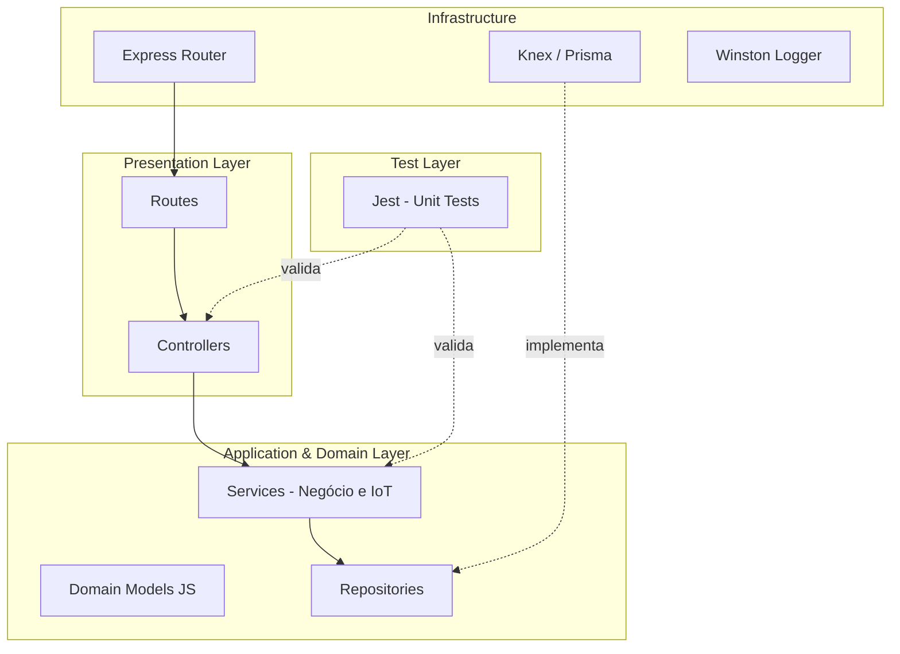
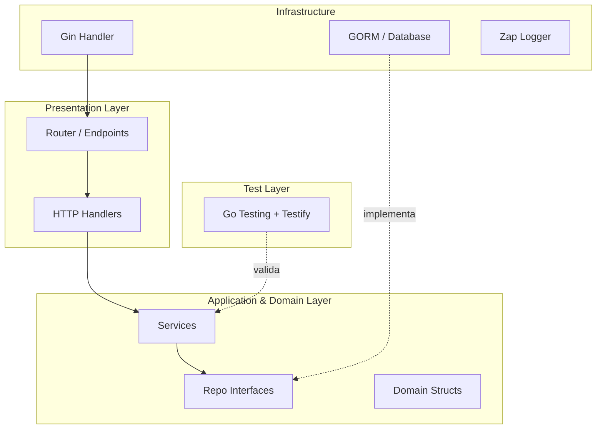
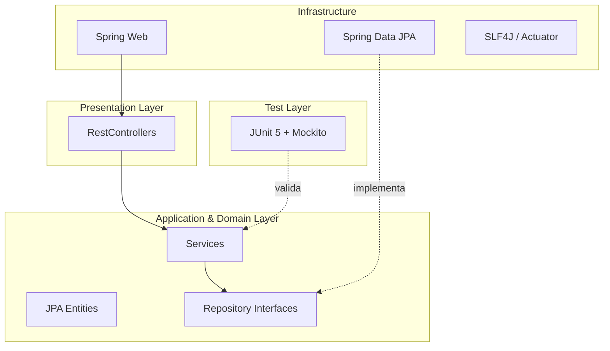
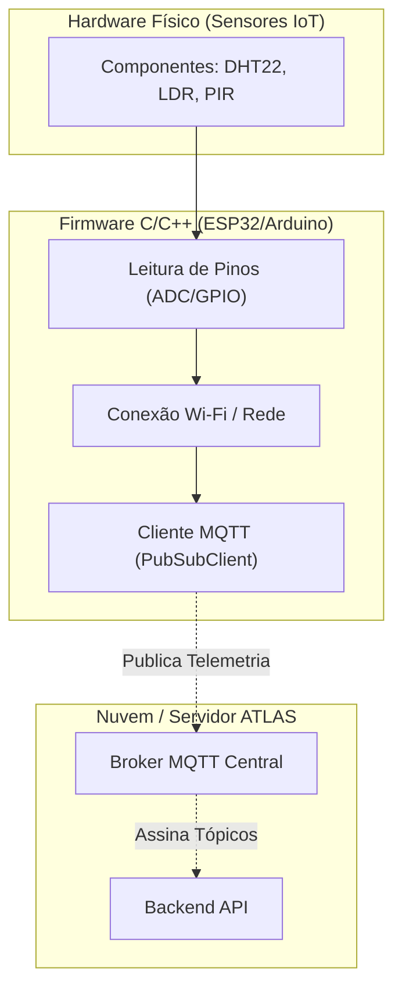
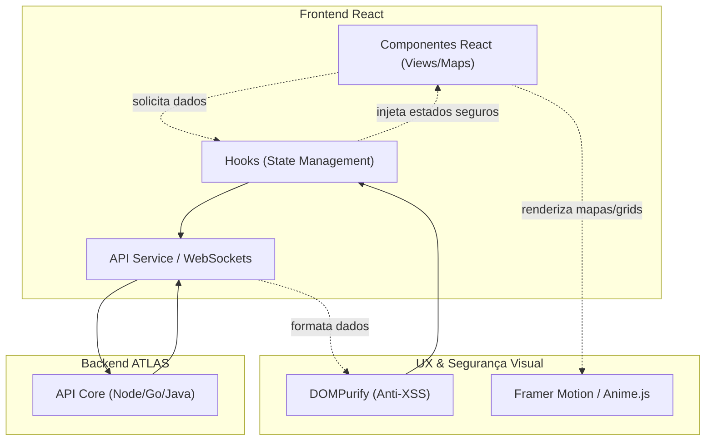
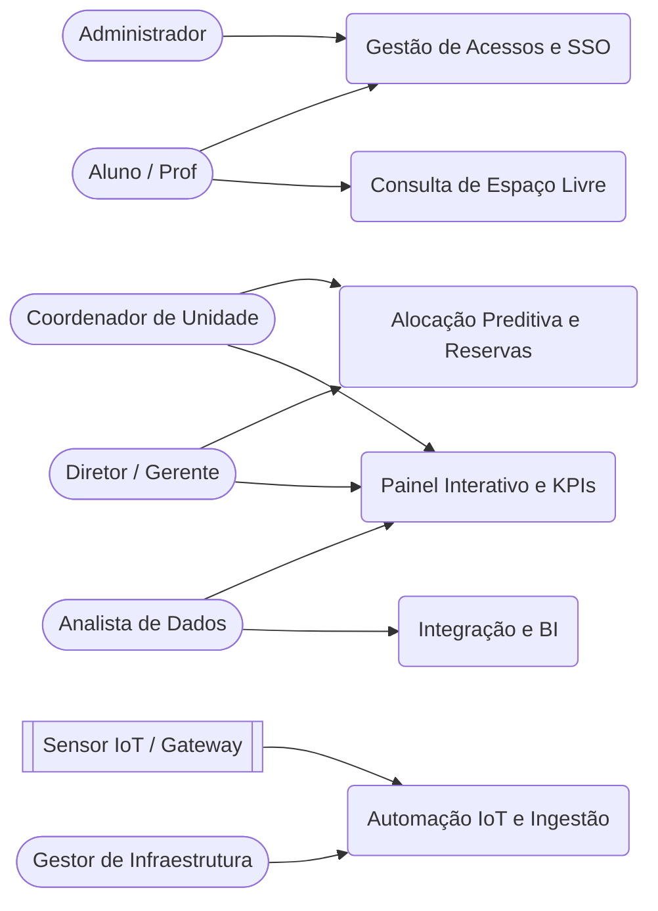

# Arquitetura e Modelagem de Dados - PROJETO ATLAS

Este documento descreve a arquitetura da solução para o Projeto ATLAS (Gestão Institucional de Espaços e Arranjos Pedagógicos), abordando a integração com dispositivos IoT, processamento de dados (Big Data), adoção de boas práticas, testes unitários, árvores de projeto teóricas e mapeamento de bibliotecas para **Node.js (JavaScript)**, **Golang** e **Java (Spring)**.

> [!NOTE]
> **Aviso:** Como o projeto envolve IoT em sua concepção, todas as definições relacionadas a sensores, gateways e protocolos (MQTT/CoAP) apresentadas neste documento são, neste momento, **sugestões** para apoiar o planejamento arquitetural e não estão fixadas.

---

## 1. Diagrama Arquitetural de Integração

Abaixo, um diagrama macro demonstrando a comunicação entre as interfaces de visualização, a API, o banco de dados e a camada IoT.

```text
 ______________________     ______________________     ______________________
|                      |   |                      |   |                      |
|  Dashboards (Gestor) |   | App Web / Portais    |   | Sensores IoT /       |
|   (React / Vue)      |   | (Coordenadores)      |   | Dispositivos Edge    |
|______________________|   |______________________|   |______________________|
            |                         |                          |
            |                         |                          | MQTT / CoAP
             \________________________|                          | (Sugestão)
                                      |                          v
                               HTTPS (REST API)         .-----------------.
                                      |                 |  IoT Gateway /  |
             .------------------------v-----------------| Broker de Mens. |
             |                                          '-----------------'
             |              BACKEND ATLAS (API DDD)              |
             |          (Node.js / Golang / Java Spring)         |
             |                                                   |
             |  .-----------------.       .-----------------.    |
             |  |                 |       |                 |    |
             |  |    JWT Auth     |       |   RBAC Roles    |    |
             |  |                 |       |                 |    |
             |  '-----------------'       '-----------------'    |
             |                                                   |
             |  .-----------------.       .-----------------.    |
             |  |                 |       |                 |    |
             |  | Unit Testing &  |       | Algoritmo       |    |
             |  |   Validation    |       |  Preditivo      |    |
             |  '-----------------'       '-----------------'    |
             |                                                   |
             '------------------------+--------------------------'
                                      |
                                      | Protocolo TCP
                                      v
             .-------------------------------------------------.
             |                                                 |
             |             Banco de Dados Analítico            |
             |        (PostgreSQL Relacional + TSDB)           |
             |                                                 |
             '-------------------------------------------------'
```

---

## 1.5. Modelagem de Dados Relacional (PostgreSQL ATLAS)

O modelo de dados relacional do **ATLAS** foi projetado mesclando uma estrutura transacional (para cadastro de unidades, espaços e reservas) com tabelas analíticas (telemetria IoT). Essa modelagem permite armazenar os dados físicos eficientemente enquanto acomoda entidades de predição e regras de negócio de alocação.

> [!NOTE]
> **Aviso:** Esta modelagem é uma base estrutural. O formato exato de telemetria pode migrar parcialmente para um banco Time-Series nativo.



---

## 2. Design Patterns (Padrões de Projeto) Sugeridos

*   **Node.js (JavaScript): Layered Architecture (Controller-Service-Repository)**. Foco em separar responsabilidades por pastas. O padrão de *Injeção de Dependências* manual ou com factory functions ajuda na hora de escrever testes unitários.
*   **Golang: Hexagonal Architecture (Ports and Adapters)**. Em Go, é idiomático definir interfaces (Ports) onde as dependências são necessárias e implementá-las na camada de infraestrutura (Adapters), garantindo um baixo acoplamento.
*   **Java (Spring Boot): MVC Clássico com Data Transfer Objects (DTO) e Repository Pattern**. O ecossistema Spring Boot já induz nativamente o uso do padrão Injeção de Dependência via _Beans_ (`@Service`, `@Repository`), garantindo que o domínio não vaze para os controladores usando o padrão de mapeamento DTO (com ferramentas como MapStruct).
*   **C / C++ (Edge IoT Firmware - Sugestão): Super Loop & Event-Driven**. Processamento contínuo rodando diretamente nos microcontroladores físicos (FreeRTOS ou Loop simples), realizando a leitura de pinos e publicando mensagens MQTT de forma assíncrona no broker.

---

## 3. Estruturas de Diretórios Teóricas (Project Trees)

### 3.1. Node.js (JavaScript)
```text
ATLAS_BACKEND_NODE/
├── src/
│   ├── config/              # Configurações globais (BD, Variáveis)
│   ├── controllers/         # Recebe requisições HTTP e retorna repostas
│   ├── services/            # Regras de negócio (Domain/Application)
│   ├── repositories/        # Acesso direto ao banco de dados SQL
│   ├── models/              # Estruturas/Schemas (Zod / Classes JS)
│   ├── middlewares/         # Autenticação (JWT), Validação, Logs
│   ├── routes/              # Definição das rotas do Express
│   ├── utils/               # Funções auxiliares genéricas
│   └── __tests__/           # Testes unitários (Jest)
├── .env                     # Variáveis de ambiente
├── package.json             # Dependências
└── server.js                # Ponto de entrada (Inicialização do App)
```

### 3.2. Golang
```text
atlas-backend-go/
├── cmd/
│   └── api/
│       └── main.go          # Ponto de entrada
├── internal/                # Código privado da aplicação
│   ├── handler/             # Controladores (Gin/Fiber)
│   ├── service/             # Regras de Negócio (Alocação Preditiva)
│   ├── repository/          # Acesso a dados (GORM/SQLx)
│   ├── model/               # Structs de Entidades do DB
│   └── middleware/          # Interceptadores HTTP (Auth, Logging)
├── pkg/                     # Pacotes públicos e auxiliares compartilhados
│   ├── config/              # Viper / Env reader
│   └── logger/              # Configuração do Zap/Logrus
├── tests/                   # Arquivos de teste e mocks
├── go.mod                   # Mod dependencies
└── go.sum
```

### 3.3. Java (Spring Boot)
```text
atlas-backend-java/
├── src/
│   ├── main/
│   │   ├── java/com/senac/atlas/
│   │   │   ├── AtlasApplication.java        # Entrypoint Spring Boot
│   │   │   ├── config/                      # Beans de Segurança, CORS, Swagger
│   │   │   ├── controller/                  # @RestController
│   │   │   ├── service/                     # @Service (Regras de negócio)
│   │   │   ├── repository/                  # @Repository (Interfaces Spring Data)
│   │   │   ├── model/                       # @Entity (Tabelas do Banco)
│   │   │   ├── dto/                         # Classes para Tráfego de Dados
│   │   │   └── security/                    # Configs de JWT, BCrypt, Filtros
│   │   └── resources/
│   │       └── application.yml              # Configurações (Banco, Portas)
│   └── test/
│       └── java/com/senac/atlas/            # Testes Unitários (JUnit 5 + Mockito)
├── pom.xml                                  # Maven Dependencies
└── .gitignore
```

### 3.4. C / C++ (Edge IoT Firmware - Sugestão)
Estrutura focada no código embarcado que rodará nos sensores físicos (Ex: usando PlatformIO com ESP-IDF ou framework Arduino).
```text
atlas-iot-firmware/
├── include/                 # Headers (.h) e declarações globais
├── src/
│   ├── sensors/             # Lógica de leitura dos pinos (Presença, Temperatura, CO2)
│   ├── network/             # Conectores Wi-Fi e MQTT (PubSubClient / esp-mqtt)
│   ├── config.h             # Credenciais da rede e Tópicos MQTT
│   └── main.cpp             # Ponto de entrada (Setup e Loop principal)
├── lib/                     # Bibliotecas privadas do projeto
├── test/                    # Testes de hardware in-the-loop
└── platformio.ini           # Configuração da placa e dependências (C/C++)
```

---

## 4. Diagramas de Arquitetura em Camadas (DDD)

### 4.1. Arquitetura DDD Node.js (JavaScript)


### 4.2. Arquitetura DDD Golang


### 4.3. Arquitetura DDD Java (Spring)


### 4.4. Arquitetura Edge IoT (C / C++ - Sugestão)
Firmware isolado rodando no hardware físico para injetar telemetria no servidor principal via rede, sem consumir recursos da API principal.



---

## 5. Mapeamento Geral de Bibliotecas (Baseado no Projeto ATLAS)

A tabela abaixo relaciona dependências do pacote Node.js e apresenta as alternativas correspondentes em Go e Java.

| Biblioteca Original (Node.js) | Função / Propósito | Equivalente Direto em **Golang** | Equivalente Direto em **Java (Spring)** |
| :--- | :--- | :--- | :--- |
| **express** | Framework Web / Roteamento | `gin-gonic/gin` ou `gofiber/fiber` | `Spring Web` (nativo do Spring Boot) |
| **prisma / knex** | Conexão de Banco e ORM | Usar `gorm.io/gorm` (SQL ORM) | Usar `Spring Data JPA` |
| **sqlstring** | Prevenção de Injeção SQL | Prevenção SQL Injection nativa via Prepared Statements. | Prevenção SQL Injection nativa via JPA/Hibernate. |
| **jsonwebtoken** | Autenticação por Tokens (JWT) | `github.com/golang-jwt/jwt` | `io.jsonwebtoken` (jjwt) + Spring Security |
| **bcrypt** | Hashing de senhas | `golang.org/x/crypto/bcrypt` | `BCryptPasswordEncoder` (Spring Security) |
| **morgan** | Log de Requisições HTTP | `gin.Logger()` nativo ou Middleware Fiber | `Spring Boot Actuator` ou `Zalando Logbook` |
| **body-parser** | Parseamento do Body (JSON/Form) | Nativo (`c.BindJSON()` no Gin) | Nativo (`@RequestBody` no Spring) |
| **cookie-parser** | Tratamento de Cookies | Nativo no Gin (`c.Cookie()`) | Nativo no Spring (`@CookieValue`) |
| **cors** | Controle de Acesso Origem Cruzada | `github.com/gin-contrib/cors` | `CorsConfiguration` / `@CrossOrigin` |
| **dotenv** | Leitura de Variáveis de Ambiente | `github.com/joho/godotenv` ou Viper | N/A (Usar `application.yml` ou `application.properties`) |
| **compression** | Gzip em respostas HTTP | Middleware nativo no Fiber / Gin | `server.compression.enabled=true` no yml |
| **express-rate-limit** | Limitação de Requisições (Rate Limit) | `github.com/didip/tollbooth` | `Bucket4j` + `JCache` |
| **helmet** | Segurança de Cabeçalhos HTTP (Headers) | `github.com/gofiber/helmet` | Configurações automáticas do `Spring Security` headers |
| **node-cache** | Cache local de curta duração | `github.com/patrickmn/go-cache` | Nativo com anotações `@Cacheable` e Spring Cache |
| **xlsx** | Leitura/Criação CSV/Planilhas (RF021) | `github.com/qax-os/excelize` | `Apache POI` (org.apache.poi) |
| **zod** | Validação robusta de Tipos/Schemas | `github.com/go-playground/validator` | `Jakarta Bean Validation` (`@Valid`, `@NotNull`) |
| **jest** / **supertest** | Testes Unitários e de Integração API | Framework nativo `testing` + `stretchr/testify` | `JUnit 5` + `Mockito` + `MockMvc` |
| **swagger-ui-express** | Documentação interativa (OpenAPI 3.0) | `swaggo/gin-swagger` | `springdoc-openapi-starter-webmvc-ui` |
| **mqtt** / **aedes** | Integração IoT (MQTT Client / Broker) | `eclipse/paho.mqtt.golang` | `org.eclipse.paho.client.mqttv3` |

---

## 6. Arquitetura Frontend em React (Consumidor do Backend DDD)

*(Nota: Como o foco principal da equipe é backend, as ferramentas listadas abaixo são fortes **sugestões** de mercado para lidar de forma fácil com complexidades visuais, mantendo o frontend organizado, responsivo e capaz de lidar com atualizações de sensores).*

### 6.1. Design Pattern: Feature-Sliced Design (FSD) / Camadas Anti-Corrupção
Para um frontend consumir um backend DDD de gestão espacial, recomenda-se a abordagem **Feature-Sliced Design**. Isso significa dividir pastas por **Domínios/Bounded Contexts** (ex: `Auth`, `Dashboard`, `Reservas`, `IoT`).

### 6.2. Estrutura de Diretórios Teórica (Project Tree React)
```text
atlas-frontend-react/
├── src/
│   ├── app/                   # Roteamento global e Contextos Principais (App.jsx, router.js)
│   ├── features/              # (Domínios de Negócio - Equivalentes ao DDD)
│   │   ├── authentication/    
│   │   │   ├── components/    # UI visual do Login (ex: <LoginForm />)
│   │   │   ├── api/           # Chamadas HTTP (Axios) para a API de login
│   │   │   └── hooks/         # Custom Hooks com a lógica de estado do Login
│   │   ├── reservations/      # Domínio de Agendamentos e Calendários
│   │   ├── spaces/            # Domínio de Gestão Predial (Mapas)
│   │   └── dashboards/        # Domínio Analítico (Gráficos de IoT)
│   ├── shared/                # Componentes puros (Botões, Inputs, Modais)
│   ├── config/                # Instâncias do Axios e variáveis de ambiente
│   └── assets/                # Imagens, Ícones
├── package.json
└── vite.config.js             # Recomendação de empacotador (Vite)
```

### 6.3. Arquitetura e Fluxo de Comunicação
O React atuará apenas como uma camada visual burra (*dumb components*). A lógica de resgate e transformação fica delegada a *Hooks*, com `Socket.IO` para a atualização em tempo real (taxa de ocupação nos mapas).



### 6.4. Sugestão de Bibliotecas (Frontend & Animações)

| Propósito | Sugestão de Biblioteca | Justificativa de Uso |
| :--- | :--- | :--- |
| **Data Fetching (Ponte c/ API)** | `@tanstack/react-query` | Gerencia *cache*, retries e updates de fundo automaticamente. |
| **Cliente HTTP e Real-Time** | `axios` e `socket.io-client` | Axios para rotas HTTP (reservas), Socket.IO para telemetria IoT. |
| **Validação de Formulários** | `react-hook-form` + `zod` | Compartilha o schema `Zod` do seu backend Node.js em tempo real. |
| **Animações e Transições** | **`framer-motion`** ou **`animejs`** | O projeto ATLAS exige visual fluido. O Framer Motion facilita animações de entrada e o Anime.js lida bem com interações complexas (ex: SVG). |
| **Mapas / Plantas Físicas** | `leaflet` ou `react-map-gl` | Essencial para o RF008 (mapa interativo com cor verde/amarelo/vermelho). |
| **Visualização Analítica** | `recharts` ou `chart.js` | Para os dashboards do RF009 e indicadores do RF010. |

### 6.5. Bibliotecas de Segurança Frontend
Atendendo aos requisitos institucionais pesados de segurança de dados e LGPD:
1. **`dompurify`**: Mitigar ataques de **XSS** (Cross-Site Scripting). Limpa nomes de usuários ou campos de descrição vindos do banco antes de montar no React.
2. **`js-cookie`**: Usar cookies com a configuração `Secure` e `HttpOnly` provida pelo backend impede roubo do JWT no React.
3. **`helmet`**: Se usar Node no front (SSR / Next.js), essa biblioteca configura cabeçalhos anti-clickjacking automaticamente.

---

## 7. Práticas de DevOps: CI/CD e Políticas de Versionamento (Git)

Toda a arquitetura do ATLAS foi desenhada visando independência de infraestrutura (*Cloud-Agnostic*). Os pipelines poderão rodar em GitHub Actions, GitLab CI, AWS CodePipeline etc.

### 7.1. Fluxo de Ambientes e Branches (Git Flow Adaptado)

*   **`main` (ou `prod`)**: Branch que reflete o **Ambiente de Produção**. Protegida contra alterações diretas (apenas Merge/PR testados e aprovados).
*   **`homologation` (ou `develop`)**: Branch de **Ambiente de Testes/Homologação**. Todo novo código vai para cá primeiro para QA ou Coordenadores testarem.
*   **`feature/*`, `fix/*`, `chore/*`**: Branches isoladas. Obrigatório que cada desenvolvedor crie uma branch própria. Proibido desenvolvimento direto em branches principais.

> [!CAUTION]
> **PROIBIÇÃO SEVERA:** É estritamente proibida a execução de comandos de sobrescrita de histórico nas branches base, como o uso de `git push --force origin main` ou `git push origin main --force`. Alterações em `main` e `homologation` só devem ocorrer através de Merges formais preservando o histórico.

### 7.2. Pipelines de CI/CD (Automação)

#### A. Pipeline de Testes e Merge (Continuous Integration)
*   **Gatilho**: Push ou PR nas branches principais.
*   **Runner**: Ubuntu.
*   **Steps (Passos)**:
    1. Executa Checkout do repositório e configura linguagem base.
    2. Instala dependências limpas.
    3. Roda **Testes Unitários** (`npm run test`, `go test ./...` ou `mvn test`).
    4. Roda **Testes de Integração** (cobertura >= 80% conforme M5.1).
    5. *(Opcional)* Analisa falhas de Linting e cobertura de código. Se falhar, Merge é bloqueado.

#### B. Pipeline de Backup e Expurgos (Cron Job)
*   **Gatilho**: Tarefa agendada (CRON).
*   **Runner**: Instância isolada Ubuntu.
*   **Rotina**: Backup do banco de dados (ex: `pg_dump`) e expurgo automático/movimento de dados brutos IoT após 5 anos para *cold storage* (RN006/RNF024).

### 7.3. Boas Práticas e Regras de Commit

O projeto segue a padronização do **Conventional Commits**:

*   **`feat:`** (Feature) Adição de nova funcionalidade (Ex: `feat: endpoint de dashboard IoT`).
*   **`fix:`** (Bug Fix) Correção de bug (Ex: `fix: correção no cálculo de ociosidade`).
*   **`docs:`** (Documentation) Documentação (Ex: `docs: update OpenAPI specs`).
*   **`style:`** (Style) Mudanças de formatação.
*   **`refactor:`** (Refactoring) Reestruturação (Ex: `refactor: extração de rotina JWT`).
*   **`perf:`** (Performance) Exclusivamente melhorar performance (Ex: `perf: adição de índice composto no TSDB`).
*   **`test:`** (Tests) Adição ou correção de testes unitários/integração.
*   **`build:`** (Build) Mudanças de dependências (package.json, go.mod, pom.xml).
*   **`ci:`** (Continuous Integration) Scripts de configuração CI/CD (workflows, Dockerfiles).
*   **`revert:`** (Revert) Reversão de um commit anterior.
*   **`chore:`** (Chore) Manutenção rotineira (Ex: limpeza de variáveis nulas).
*   **`hotfix:`** (Hotfix) Correção crítica e urgente enviada direto em Produção.

> [!IMPORTANT]
> **Regra do "Um Commit por Pacote/Responsabilidade":** Os commits devem ser granulares. A única exceção é a entrega de funcionalidade muito pequena. Evite *commits gigantescos* envolvendo múltiplos domínios.

---

## 8. Casos de Uso (Use Cases)

Com base no Documento de Requisitos (SENAC ATLAS), identificamos os principais Atores e Casos de Uso essenciais do sistema.

### 8.1. Atores do Sistema
* **Administrador do Sistema:** Gestão técnica, configurações globais e auditoria.
* **Diretor de Unidade:** Aprovador final, valida dashboards consolidados e modelo preditivo.
* **Gerente Acadêmico:** Coordenador geral do projeto, relatórios institucionais.
* **Coordenador de Unidade:** Ajusta alocações, aprova reservas, consulta KPIs por unidade.
* **Professor & Aluno:** Consulta portal, verifica disponibilidade e agenda de locais.
* **Gestor de Infraestrutura:** Automações manuais (climatização), configurações das regras locais.
* **Analista de Dados:** Acesso aos dados analíticos e criação de relatórios.
* **Equipe de Desenvolvimento:** Deploy e manutenção do painel.
* **Parceiro / Fornecedor IoT:** Acesso API escopado a telemetria e firmware.

### 8.2. Diagrama Macro de Casos de Uso



### 8.3. Descrição dos Casos de Uso Essenciais

* **UC1: Gestão de Acessos e Autenticação (RF001 a RF003)**
  * **Atores:** Todos.
  * **Descrição:** Autenticação institucional (SSO) com controle RBAC rigoroso, segregando completamente os dados entre unidades para não misturar acessos.
* **UC2: Monitoramento Interativo e Dashboards (RF007, RF009, RF010)**
  * **Atores:** Diretor, Gerente, Coordenador, Analista.
  * **Descrição:** Acompanhamento via mapas codificados em cores (Verde/Livre, Amarelo, Vermelho/Ocupado) e métricas (Ociosidade, Pico de Uso, Estimativa de Energia).
* **UC3: Alocação Preditiva (RF011, RF012)**
  * **Atores:** Coordenador, Diretor.
  * **Descrição:** Algoritmo que faz análise cruzada de espaços, capacidade e demanda pedagógica para sugerir alocações. Coordenadores podem aceitar ou rejeitar.
* **UC4: Automação e Integração IoT (RF006, RF013 a RF015)**
  * **Atores:** Sensores IoT, Gestor Infra.
  * **Descrição:** Ingestão contínua de status físico, ligando/desligando ar-condicionado e luz automaticamente fora de janelas de manutenção bloqueadas.
* **UC5: Consulta de Espaços e Conflitos (RF017, RF018)**
  * **Atores:** Aluno, Professor.
  * **Descrição:** Visualização diária/mensal dos espaços com verificação em tempo real de conflitos de horário.
* **UC6: Auditoria, LGPD e Integração (RF020, RF022 a RF025)**
  * **Atores:** Administrador, Analista, Parceiro IoT.
  * **Descrição:** Geração inalterável de logs de ações sensíveis, permissões de APIs, exportação de datasets em formato Parquet para BI, além de fluxos de aceite/revogação de privacidade.
