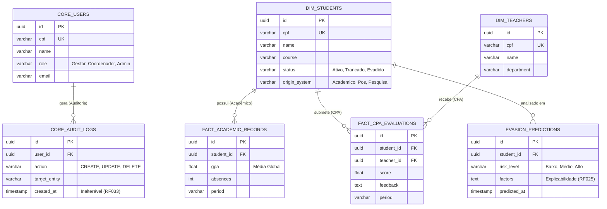
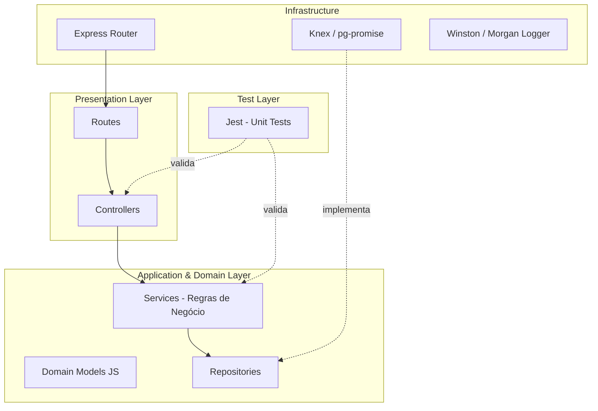
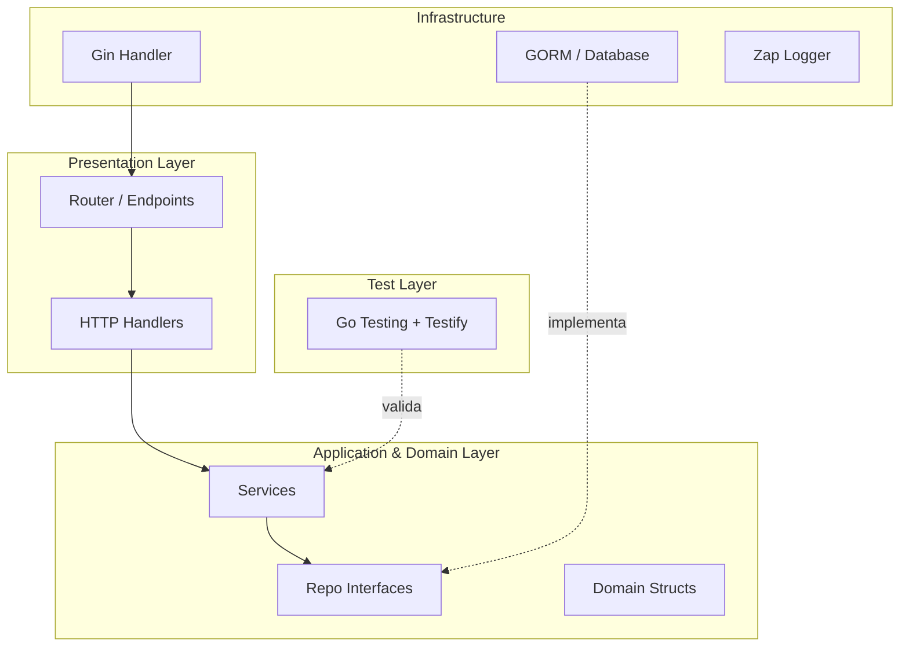
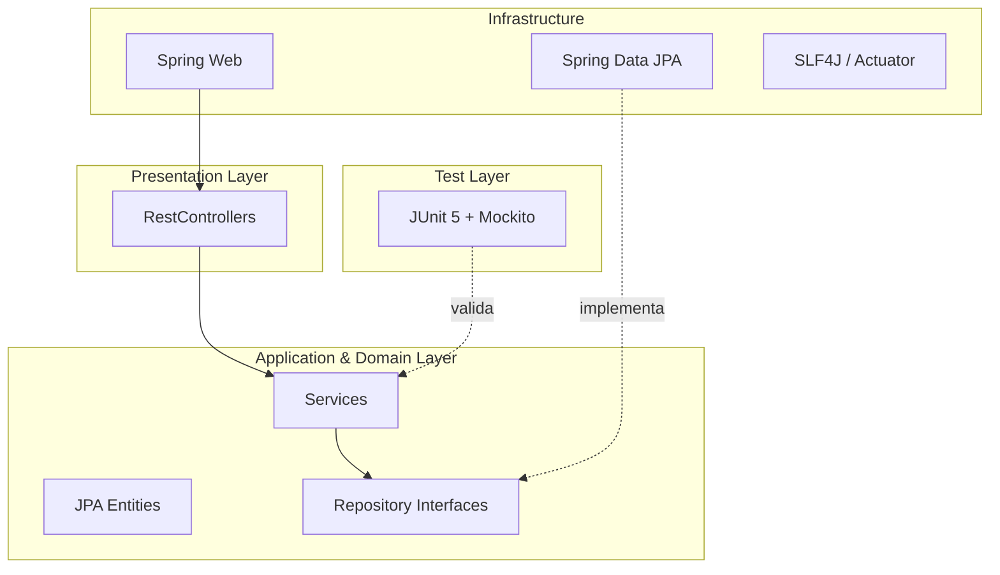
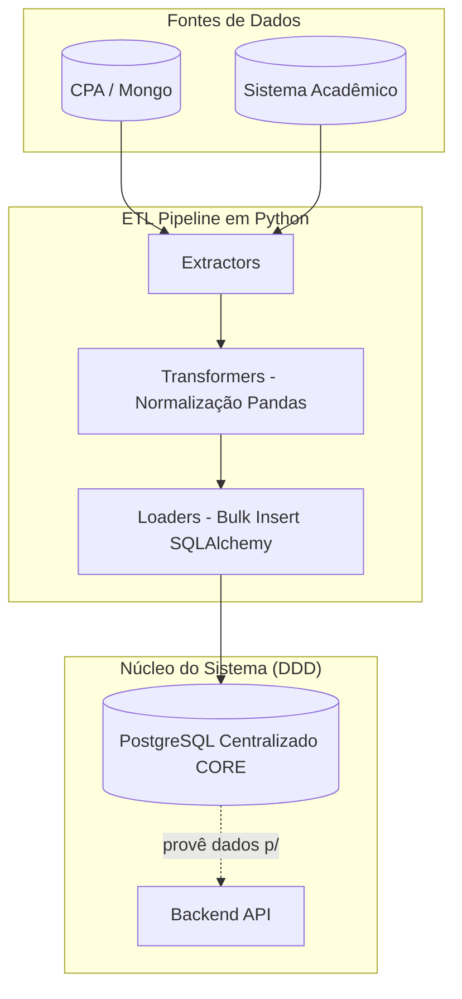
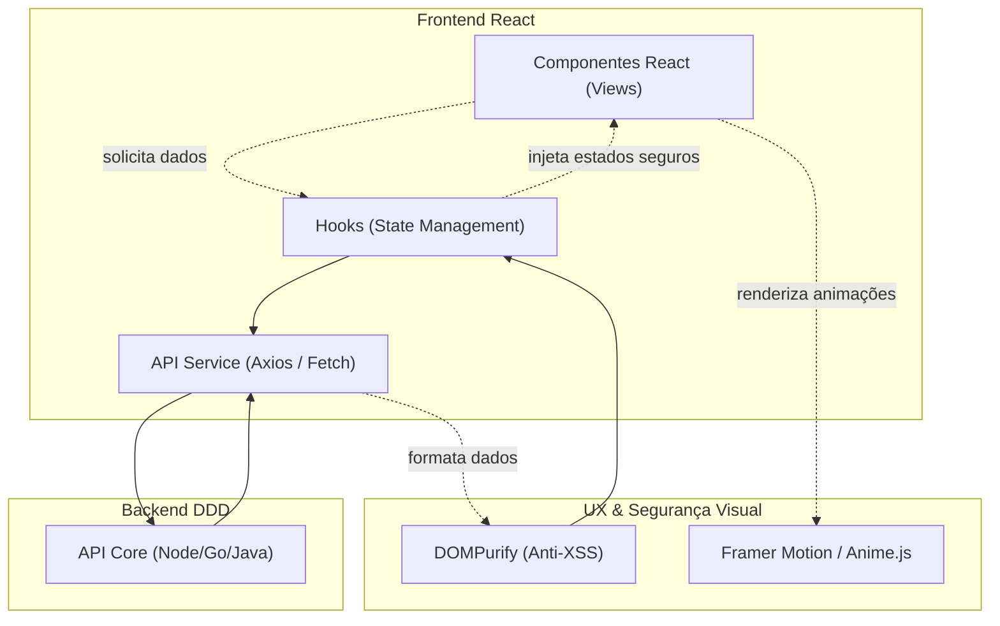

# Arquitetura e Modelagem de Dados - PROJETO CORE

Este documento descreve a arquitetura da solução para o Projeto CORE, com a migração para banco de dados SQL (PostgreSQL), adoção de boas práticas, testes unitários, árvores de projeto teóricas e mapeamento de bibliotecas para **Node.js (JavaScript)**, **Golang** e **Java (Spring)**.

---

## 1. Diagrama Arquitetural de Integração

Abaixo, um diagrama macro demonstrando a comunicação entre as interfaces de visualização, a API e o banco de dados.

```text
 ______________________     ______________________     ______________________
|                      |   |                      |   |                      |
|  Dashboards (CPA)    |   | Módulo Gestor (Web)  |   | Outros Integradores  |
|   (React / Vue)      |   |   (React / Vue)      |   |    (BI / Scripts)    |
|______________________|   |______________________|   |______________________|
            |                         |                          |
            |                         |                          |
             \________________________|_________________________/
                                      |
                              HTTPS (REST API)
                                      |
             .------------------------v------------------------.
             |                                                 |
             |              BACKEND CORE (API DDD)             |
             |          (Node.js / Golang / Java Spring)       |
             |                                                 |
             |  .-----------------.       .-----------------.  |
             |  |                 |       |                 |  |
             |  |    JWT Auth     |       |   RBAC Roles    |  |
             |  |                 |       |                 |  |
             |  '-----------------'       '-----------------'  |
             |                                                 |
             |  .-----------------.       .-----------------.  |
             |  |                 |       |                 |  |
             |  | Unit Testing &  |       | ETL / Integr.   |  |
             |  |   Validation    |       |   (Python)      |  |
             |  '-----------------'       '-----------------'  |
             |                                                 |
             '------------------------+------------------------'
                                      |
                                      | Protocolo TCP (Port 5432)
                                      v
             .-------------------------------------------------.
             |                                                 |
             |             PostgreSQL (Relacional)             |
             |              (SQL ORM / Driver)                 |
             |                                                 |
             '-------------------------------------------------'
```

---

## 1.5. Modelagem de Dados Relacional (PostgreSQL CORE)

O modelo de dados relacional do **CORE** foi projetado mesclando uma estrutura analítica (com tabelas Fato para registros de avaliações e tabelas Dimensão para alunos e professores) com tabelas nativas transacionais. Essa modelagem permite armazenar os dados importados eficientemente enquanto acomoda entidades fundamentais do sistema, como as tabelas de controle de usuários, armazenamento de predições de IA e as trilhas de auditoria de segurança.

> [!NOTE]
> **Aviso:** Esta modelagem é uma prova de conceito e está propositalmente incompleta, visto que ainda não se tem o mapeamento de quais tipos de dados serão integrados em sua totalidade vindos dos outros sistemas institucionais.



---

## 2. Design Patterns (Padrões de Projeto) Sugeridos

*   **Node.js (JavaScript): Layered Architecture (Controller-Service-Repository)**. Por ser JavaScript, foca-se em separar responsabilidades por pastas. O padrão de *Injeção de Dependências* manual ou com factory functions ajuda na hora de escrever testes unitários.
*   **Golang: Hexagonal Architecture (Ports and Adapters)**. Em Go, é idiomático definir interfaces (Ports) onde as dependências são necessárias e implementá-las na camada de infraestrutura (Adapters), garantindo um baixo acoplamento.
*   **Java (Spring Boot): MVC Clássico com Data Transfer Objects (DTO) e Repository Pattern**. O ecossistema Spring Boot já induz nativamente o uso do padrão Injeção de Dependência via _Beans_ (`@Service`, `@Repository`), garantindo que o domínio não vaze para os controladores usando o padrão de mapeamento DTO (com ferramentas como MapStruct).
*   **Python (ETL Pipeline): Pipeline Pattern e Strategy**. Como o script ETL processa dados paralelamente ao backend DDD, aplicamos o padrão de "Pipeline" separando (Extract, Transform, Load). O *Strategy Pattern* permite lidar dinamicamente com fontes distintas de dados (CPA, Pesquisa, Acadêmico).

---

## 3. Estruturas de Diretórios Teóricas (Project Trees)

### 3.1. Node.js (JavaScript)
```text
CPA2026SENACBACKEND/
├── src/
│   ├── config/              # Configurações globais (BD, Variáveis)
│   ├── controllers/         # Recebe requisições HTTP e retorna repostas
│   ├── services/            # Regras de negócio (Domain/Application)
│   ├── repositories/        # Acesso direto ao banco de dados SQL (ex: pg-promise)
│   ├── models/              # Estruturas/Schemas (Zod / Classes JS)
│   ├── middlewares/         # Autenticação (JWT), Validação, Logs
│   ├── routes/              # Definição das rotas do Express
│   ├── utils/               # Funções auxiliares genéricas
│   └── __tests__/           # Testes unitários (Jest)
├── .env                     # Variáveis de ambiente
├── package.json             # Dependências
└── server.js                # Ponto de entrada (Inicialização do App)
```

### 3.2. Golang
```text
cpa-backend-go/
├── cmd/
│   └── api/
│       └── main.go          # Ponto de entrada
├── internal/                # Código privado da aplicação
│   ├── handler/             # Controladores (Gin/Fiber)
│   ├── service/             # Regras de Negócio
│   ├── repository/          # Acesso a dados (GORM/SQLx)
│   ├── model/               # Structs de Entidades do DB
│   └── middleware/          # Interceptadores HTTP (Auth, Logging)
├── pkg/                     # Pacotes públicos e auxiliares compartilhados
│   ├── config/              # Viper / Env reader
│   └── logger/              # Configuração do Zap/Logrus
├── tests/                   # Arquivos de teste e mocks
├── go.mod                   # Mod dependencies
└── go.sum
```

### 3.3. Java (Spring Boot)
```text
cpa-backend-java/
├── src/
│   ├── main/
│   │   ├── java/com/senac/cpa/
│   │   │   ├── CpaApplication.java        # Entrypoint Spring Boot
│   │   │   ├── config/                    # Beans de Segurança, CORS, Swagger
│   │   │   ├── controller/                # @RestController
│   │   │   ├── service/                   # @Service (Regras de negócio)
│   │   │   ├── repository/                # @Repository (Interfaces Spring Data)
│   │   │   ├── model/                     # @Entity (Tabelas do Banco)
│   │   │   ├── dto/                       # Classes para Tráfego de Dados
│   │   │   └── security/                  # Configs de JWT, BCrypt, Filtros
│   │   └── resources/
│   │       └── application.yml            # Configurações (Banco, Portas)
│   └── test/
│       └── java/com/senac/cpa/            # Testes Unitários (JUnit 5 + Mockito)
├── pom.xml                                # Maven Dependencies
└── .gitignore
```

### 3.4. Python (Pipeline ETL)
Como a integração rodará junto ao projeto principal (possivelmente no mesmo ambiente ou num container lateral), sua estrutura é focada em processamento em lote, servindo de base de inteligência para o núcleo DDD.
```text
cpa-etl-python/
├── src/
│   ├── extractors/          # Conectores de fontes (CPA Mongo, Acadêmico SQL)
│   ├── transformers/        # Limpeza e Cruzamento de Dados (Pandas)
│   ├── loaders/             # Inserção no PostgreSQL CORE (SQLAlchemy)
│   ├── models/              # Pydantic / DTOs de Validação Estrutural
│   └── utils/               # Arquivos auxiliares e Configurações de Log
├── tests/                   # Pytest Scripts (Testes de pipeline)
├── .env                     # Variáveis (Endpoints, Senhas DB)
├── main.py                  # Ponto de entrada (Orquestrador do Job ETL)
└── requirements.txt         # Dependências (pandas, sqlalchemy, psycopg2)
```

---

## 4. Diagramas de Arquitetura em Camadas (DDD)

### 4.1. Arquitetura DDD Node.js (JavaScript)


### 4.2. Arquitetura DDD Golang


### 4.3. Arquitetura DDD Java (Spring)


### 4.4. Arquitetura da Pipeline ETL (Python)
Embora não seja uma API web (como as arquiteturas acima), o script ETL implementa a separação de responsabilidades rodando ao lado do servidor principal (DDD) para manter a base relacional sempre alimentada.



---

## 5. Mapeamento Geral de Bibliotecas (Baseado no Projeto CPA Atual)

Algumas dessas libs estão sendo usadas no projeto CPA. A tabela abaixo relaciona essas dependências do pacote Node.js atual e apresenta as alternativas correspondentes em Go e Java. Bibliotecas incompatíveis com a nova arquitetura SQL (como Mongoose) foram substituídas por abordagens focadas em bancos relacionais.

| Biblioteca Original (Node.js) | Função / Propósito | Equivalente Direto em **Golang** | Equivalente Direto em **Java (Spring)** |
| :--- | :--- | :--- | :--- |
| **express** | Framework Web / Roteamento | `gin-gonic/gin` ou `gofiber/fiber` | `Spring Web` (nativo do Spring Boot) |
| **mongoose** | Conexão de Banco e ORM | Usar `gorm.io/gorm` (SQL ORM) | Usar `Spring Data JPA` |
| **sqlstring** (Substitui express-mongo-sanitize) | Prevenção de Injeção SQL | Prevenção SQL Injection nativa via Prepared Statements no `database/sql` ou GORM. | Prevenção SQL Injection nativa via JPA/Hibernate e Prepared Statements. |
| **jsonwebtoken** | Autenticação por Tokens (JWT) | `github.com/golang-jwt/jwt` | `io.jsonwebtoken` (jjwt) + Spring Security |
| **bcrypt** | Hashing de senhas | `golang.org/x/crypto/bcrypt` | `BCryptPasswordEncoder` (Spring Security) |
| **morgan** | Log de Requisições HTTP | `gin.Logger()` nativo ou Middleware Fiber | `Spring Boot Actuator` ou `Zalando Logbook` |
| **body-parser** | Parseamento do Body (JSON/Form) | Nativo (`c.BindJSON()` no Gin) | Nativo (`@RequestBody` no Spring) |
| **cookie-parser** | Tratamento de Cookies | Nativo no Gin (`c.Cookie()`) | Nativo no Spring (`@CookieValue`) |
| **cors** | Controle de Acesso Origem Cruzada | `github.com/gin-contrib/cors` | `CorsConfiguration` / `@CrossOrigin` |
| **dotenv** | Leitura de Variáveis de Ambiente | `github.com/joho/godotenv` ou Viper | N/A (Usar `application.yml` ou `application.properties`) |
| **compression** | Gzip em respostas HTTP | Middleware nativo no Fiber / Gin | `server.compression.enabled=true` no yml |
| **express-rate-limit** | Limitação de Requisições (Rate Limit) | `github.com/didip/tollbooth` | `Bucket4j` + `JCache` |
| **helmet** | Segurança de Cabeçalhos HTTP (Headers) | `github.com/gofiber/helmet` ou middleware customizado | Configurações automáticas do `Spring Security` headers |
| **node-cache** | Cache local de curta duração | `github.com/patrickmn/go-cache` | Nativo com anotações `@Cacheable` e Spring Cache |
| **xlsx** | Leitura e Criação de planilhas Excel | `github.com/qax-os/excelize` | `Apache POI` (org.apache.poi) |
| **zod** | Validação robusta de Tipos/Schemas | `github.com/go-playground/validator` (usando tags struct) | `Jakarta Bean Validation` (`@Valid`, `@NotNull`) |
| **jest** / **supertest** | Testes Unitários e de Integração API | Framework nativo `testing` + `stretchr/testify` para Asserções e Mocks | `JUnit 5` + `Mockito` + `MockMvc` |
| **swagger-ui-express** | Documentação interativa da API | `swaggo/gin-swagger` | `springdoc-openapi-starter-webmvc-ui` |
| **TypeORM Subscribers / Hooks Customizados** | **Trilha de Auditoria Inalterável (RF033)** - Registro de quem, quando e qual ação crítica | Hooks GORM (`AfterCreate`, `AfterUpdate`, etc.) para Tabela de Auditoria | **Spring Data Envers** (Hibernate Envers) |
| **nodemailer** | **Recuperação de Senha (RF004)** - Envio de e-mails transacionais (SMTP) | `github.com/wneessen/go-mail` ou `gomail.v2` | `spring-boot-starter-mail` (JavaMailSender) |

---

## 6. Arquitetura Frontend em React (Consumidor do Backend DDD)

*(Nota: Como o foco principal da equipe é backend, as ferramentas listadas abaixo são fortes **sugestões** de mercado para lidar de forma fácil com complexidades visuais, mantendo o frontend altamente organizado, robusto e responsivo, mesmo sem conhecimento avançado prévio em front).*

### 6.1. Design Pattern: Feature-Sliced Design (FSD) / Camadas Anti-Corrupção
Para um frontend consumir um backend DDD sem virar um emaranhado complexo, recomenda-se a abordagem **Feature-Sliced Design**. Isso significa que as pastas do frontend são divididas pelos mesmos **Domínios/Bounded Contexts** do backend (ex: `Auth`, `Evaluations`, `Dashboards`), facilitando a localização de código pelas equipes de backend.

### 6.2. Estrutura de Diretórios Teórica (Project Tree React)
```text
cpa-frontend-react/
├── src/
│   ├── app/                   # Roteamento global e Contextos Principais (App.jsx, router.js)
│   ├── features/              # (Domínios de Negócio - Equivalentes ao DDD)
│   │   ├── authentication/    
│   │   │   ├── components/    # UI visual do Login (ex: <LoginForm />)
│   │   │   ├── api/           # Chamadas HTTP (Axios) para a API DDD de login
│   │   │   └── hooks/         # Custom Hooks com a lógica de estado do Login
│   │   ├── evaluations/       # Domínio da CPA (Questionários, Formulários)
│   │   └── dashboards/        # Domínio Institucional (Gráficos, Indicadores)
│   ├── shared/                # Componentes puros (Botões, Inputs, Modais)
│   ├── config/                # Instâncias do Axios e variáveis de ambiente
│   └── assets/                # Imagens, Ícones
├── package.json
└── vite.config.js             # Recomendação de empacotador (Vite)
```

### 6.3. Arquitetura e Fluxo de Comunicação
O React atuará apenas como uma camada visual burra (*dumb components*). A lógica de resgate e transformação de DTOs fica delegada a *Hooks*, separando a view do acesso a dados.



### 6.4. Sugestão de Bibliotecas (Frontend & Animações)

| Propósito | Sugestão de Biblioteca | Justificativa de Uso |
| :--- | :--- | :--- |
| **Data Fetching (Ponte c/ API)** | `@tanstack/react-query` | Intermediário perfeito entre o React e a API DDD. Gerencia *cache*, retries, loading e validação de forma automática. |
| **Cliente HTTP** | `axios` | Excelente para o uso de "Interceptadores", injetando o JWT Token silenciosamente em toda requisição ao backend. |
| **Validação de Formulários** | `react-hook-form` + `zod` | Permite validar inputs na tela em tempo real usando o exato mesmo schema `Zod` do seu backend Node.js. |
| **Animações e Transições** | **`framer-motion`** ou **`animejs`** | O projeto CORE exige visual "Premium". O **Framer Motion** é absurdamente simples para o ecossistema React (animações de entrada, fade, arrastar componentes) sem poluir o código. O **Anime.js** é imbatível para orquestração de animações complexas (ex: SVG ou gráficos dinâmicos). |
| **Visualização Analítica** | `recharts` ou `chart.js` | Ideais para desenhar os dashboards interativos exigidos nos requisitos de Business Intelligence do CORE. |

### 6.5. Bibliotecas de Segurança Frontend
Atendendo aos requisitos institucionais pesados de segurança de dados e LGPD da aplicação:
1. **`dompurify`**: Biblioteca crucial para mitigar ataques de **XSS** (Cross-Site Scripting). Como o CORE integrará dados vindos de diversas fontes (incluindo textos livres e feedbacks consumidos do banco da CPA), o DOMPurify garante que a leitura e exibição desses dados nos painéis dos gestores e coordenadores seja totalmente sanitizada antes da renderização no React.
2. **`js-cookie`**: Embora localStorage seja fácil, usar cookies com a configuração `Secure` e `HttpOnly` provida pelo backend impede que scripts de terceiros roubem o JWT do usuário no React.
3. **`helmet`**: Se a aplicação utilizar Node no front (SSR / Next.js), essa biblioteca configura cabeçalhos de segurança vitais no navegador (CSP, anti-clickjacking) automaticamente.

---

## 7. Práticas de DevOps: CI/CD e Políticas de Versionamento (Git)

Toda a arquitetura do projeto CORE (Backend, Frontend e ETL) foi desenhada visando independência de infraestrutura (*Cloud-Agnostic*). Sendo assim, os pipelines descritos abaixo poderão ser implementados de forma fluída rodando em **GitHub Actions, GitLab CI, AWS CodePipeline ou Azure DevOps**.

### 7.1. Fluxo de Ambientes e Branches (Git Flow Adaptado)

O projeto deve seguir um fluxo estrito de controle de código, separando os ambientes:

*   **`main` (ou `prod`)**: Branch que reflete o **Ambiente de Produção**. Protegida contra alterações diretas. Apenas recebe código via *Merge/Pull Requests* perfeitamente testados e aprovados.
*   **`homologation` (ou `develop`)**: Branch que reflete o **Ambiente de Testes/Homologação**. Todo novo código concluído vai primeiramente para cá para que a equipe de QA ou Coordenadores testem a aplicação antes do lançamento.
*   **`feature/*`, `fix/*`, `chore/*`**: Branches isoladas de desenvolvimento. **Regra de Ouro**: Cada desenvolvedor deve *obrigatoriamente* criar uma branch própria para trabalhar na sua demanda local. É terminantemente proibido o desenvolvimento direto em branches principais.

> [!CAUTION]
> **PROIBIÇÃO SEVERA:** É estritamente proibida a execução de comandos de sobrescrita de histórico nas branches base, como o uso de `git push --force origin main` ou `git push origin main --force`. Alterações em `main` e `homologation` só devem ocorrer através de Merges formais preservando o histórico completo.

### 7.2. Pipelines de CI/CD (Automação)

A plataforma deverá contar, no mínimo, com dois pipelines principais, provisionados via _runners_ virtuais (ex: Ubuntu-latest no GitHub Actions).

#### A. Pipeline de Testes e Merge (Continuous Integration)
Este fluxo roda automaticamente toda vez que um desenvolvedor abre um *Pull Request* ou faz Push contra a `homologation` ou `main`.
*   **Gatilho**: Push ou PR nas branches principais.
*   **Runner**: Ubuntu.
*   **Steps (Passos)**:
    1. Executa o _Checkout_ do repositório e configura a linguagem base.
    2. Instala as dependências de forma limpa.
    3. Roda os **Testes Unitários** (O comando muda conforme a stack escolhida no Backend: `npm run test` para Node, `go test ./...` para Go, ou `mvn test` para Java Spring).
    4. Roda os **Testes de Integração** para garantir que módulos externos estejam síncronos.
    5. *(Opcional)* Analisa falhas de Linting e cobertura de código (Code Coverage). Se algum step falhar, o *Merge* é bloqueado.

#### B. Pipeline de Backup e Rotinas (Cron Job)
*   **Gatilho**: Tarefa agendada (CRON).
*   **Runner**: Instância isolada Ubuntu.
*   **Rotina Diária (`0 3 * * *`)**: Todos os dias, às **03:00 da manhã**, o pipeline de Backup deve ser executado, realizando um `pg_dump` da base PostgreSQL do CORE, validando sua integridade, e transferindo-o via criptografia para um local frio (Ex: Bucket S3 de Backup AWS ou Azure Blob Storage).

### 7.3. Boas Práticas e Regras de Commit

O projeto segue a padronização do **Conventional Commits**, facilitando a geração de changelogs e o mapeamento rápido da evolução do sistema. Todo commit deve começar com um prefixo descritivo:

*   **`feat:`** (Feature) Adição de uma nova funcionalidade no sistema (Ex: `feat: criação do módulo de alertas de evasão`).
*   **`fix:`** (Bug Fix) Correção de um bug, erro ou falha em uma funcionalidade existente (Ex: `fix: correção no cálculo de faltas do painel`).
*   **`docs:`** (Documentation) Alterações exclusivamente em documentação, README, comentários de código ou arquivos `.md` (Ex: `docs: atualização do diagrama de banco no README`).
*   **`style:`** (Style) Mudanças de formatação que não afetam a lógica do código — espaçamento, ponto-e-vírgula, indentação (Ex: `style: padronização de aspas simples nos services`).
*   **`refactor:`** (Refactoring) Reescrita ou reestruturação de código existente sem alterar o comportamento externo — nem corrige bug, nem adiciona feature (Ex: `refactor: extração de lógica de cálculo para utils`).
*   **`perf:`** (Performance) Alteração de código cujo objetivo é exclusivamente melhorar performance (Ex: `perf: adição de índice composto na tabela fact_cpa_evaluations`).
*   **`test:`** (Tests) Adição ou correção de testes unitários/integração, sem alterar código de produção (Ex: `test: cobertura do fluxo de login com token expirado`).
*   **`build:`** (Build) Mudanças que afetam o sistema de build ou dependências externas — package.json, go.mod, pom.xml (Ex: `build: atualização do Node para v20 LTS`).
*   **`ci:`** (Continuous Integration) Alterações nos arquivos e scripts de configuração de CI/CD — workflows, Dockerfiles, pipelines (Ex: `ci: adição do step de cobertura no pipeline de PR`).
*   **`revert:`** (Revert) Reversão de um commit anterior, referenciando o hash original (Ex: `revert: reverte feat: módulo de alertas (hash abc123)`).
*   **`chore:`** (Chore) Manutenção em tarefas rotineiras que não se encaixam nos tipos acima — limpeza de arquivos, atualização de configs genéricas (Ex: `chore: remoção de variáveis não utilizadas no .env.example`).
*   **`hotfix:`** (Hotfix) Correção de falha crítica e urgente enviada diretamente para a branch de Produção, sem passar pelo fluxo completo de homologação (Ex: `hotfix: correção de crash no login em produção`).

> [!IMPORTANT]
> **Regra do "Um Commit por Pacote/Responsabilidade":** 
> Para preservar um histórico cirúrgico, fica instituído que os commits devem ser granulares e isolados por responsabilidade de negócio ou pacote. A única exceção aceitável a essa regra é a entrega de uma funcionalidade muito pequena (Ex: alterar o Controller e o Service simultaneamente em apenas dois arquivos para entregar uma `feat:` minúscula num mesmo escopo lógico). Evite *commits gigantescos* envolvendo múltiplos domínios.
