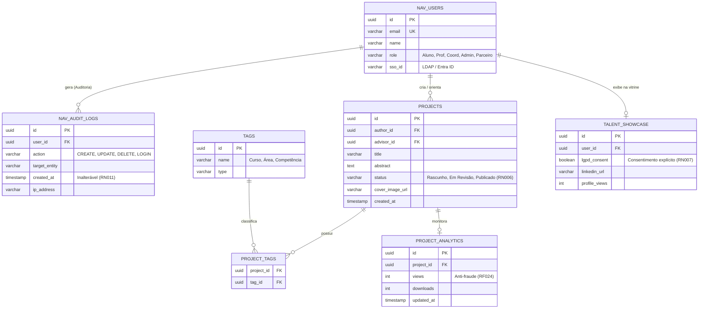
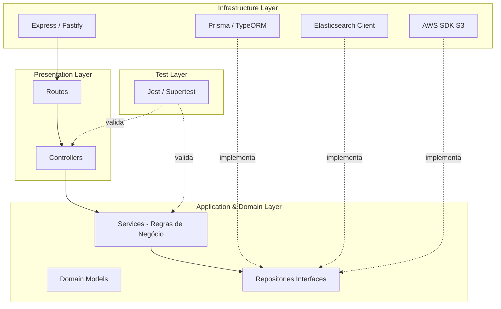
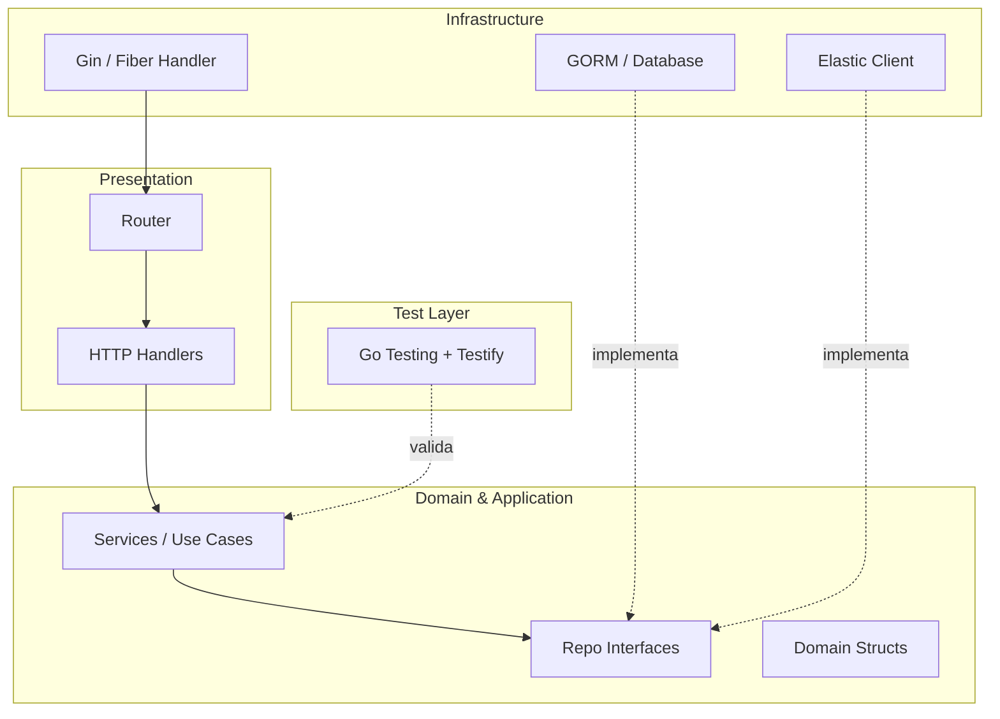
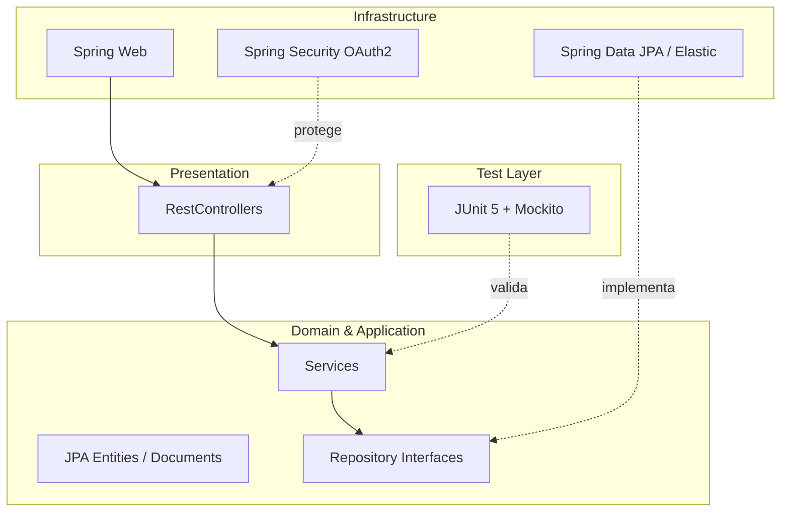
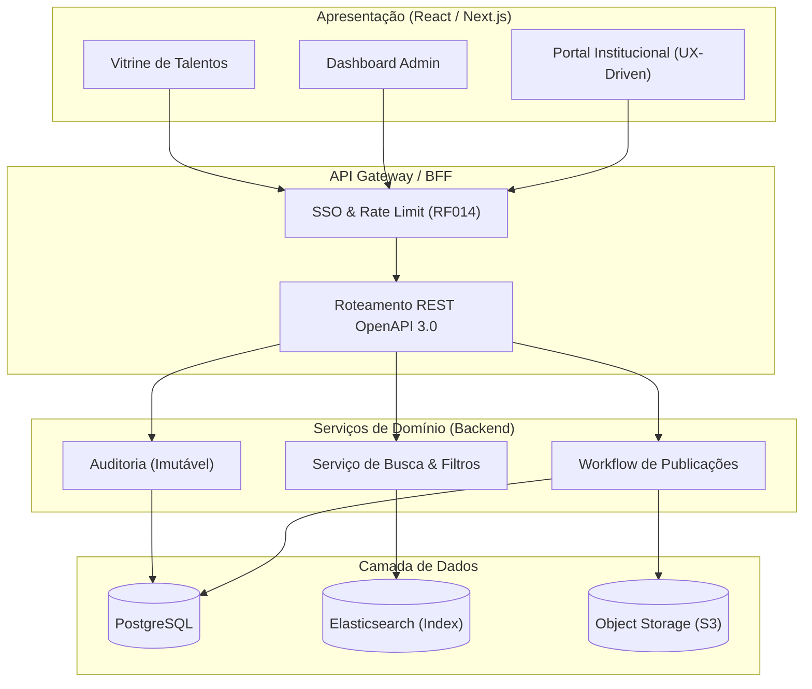
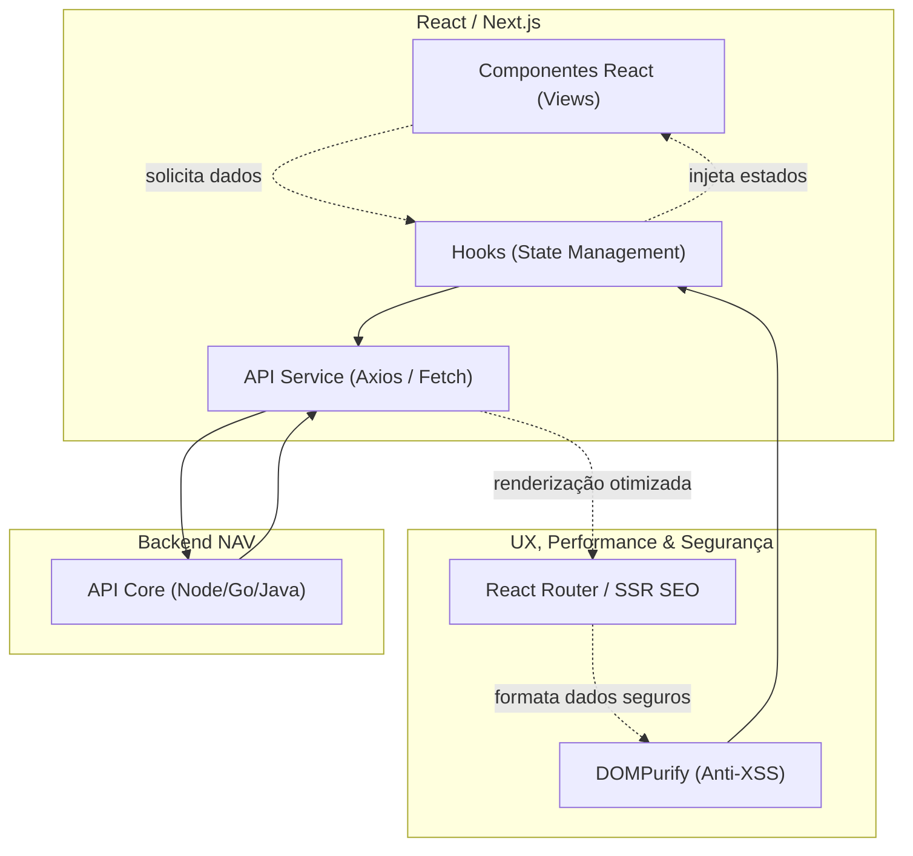
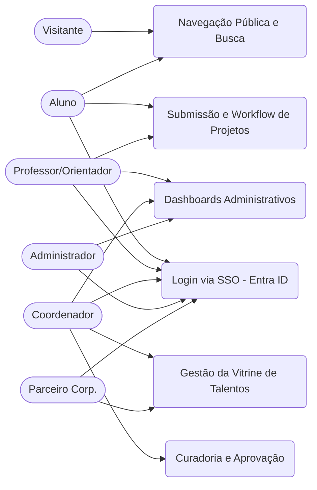

# Arquitetura e Modelagem de Dados - PROJETO SENAC NAV

Este documento descreve a arquitetura da solução para o Projeto SENAC NAV (Ecossistema Acadêmico Digital Integrado), contemplando a plataforma web modular, API-first, integração com o Hub de PIs, repositório digital dinâmico e vitrine de talentos, adotando as melhores práticas de desenvolvimento, padrões de projeto e deploy em nuvem.

---

## 1. Diagrama Arquitetural de Integração

Abaixo, um diagrama macro demonstrando a comunicação entre as interfaces de visualização, a API principal, o Hub de PIs e os bancos de dados transacionais e de busca textual.

```text
 ______________________     ______________________     ______________________
|                      |   |                      |   |                      |
|   Portal Instituc.   |   | Repositório / Vitrine|   | Parceiros Corporat.  |
|   (React / Next.js)  |   |   (React / Next.js)  |   |   (Integração API)   |
|______________________|   |______________________|   |______________________|
            |                         |                          |
            |                         |                          |
             \________________________|_________________________/
                                      |
                              HTTPS (REST API)
                                      |
             .------------------------v------------------------.
             |                                                 |
             |              BACKEND NAV (API DDD)              |
             |          (Node.js / Golang / Java Spring)       |
             |                                                 |
             |  .-----------------.       .-----------------.  |
             |  |                 |       |                 |  |
             |  | SSO / Entra ID  |       |   RBAC Roles    |  |
             |  |                 |       |                 |  |
             |  '-----------------'       '-----------------'  |
             |                                                 |
             |  .-----------------.       .-----------------.  |
             |  |                 |       |                 |  |
             |  | Webhooks (PIs)  |       |   Upload/S3     |  |
             |  |                 |       |                 |  |
             |  '-----------------'       '-----------------'  |
             |                                                 |
             '------------------+-------------------+----------'
                                |                   |
                 Protocolo TCP (Port 5432)     REST (Port 9200)
                                |                   |
                                v                   v
             .-------------------------.  .-------------------------.
             |                         |  |                         |
             | PostgreSQL (Relacional) |  | Elasticsearch / Meilisearch |
             |   (Dados Transacionais) |  |   (Busca Textual/Filtros)   |
             |                         |  |                         |
             '-------------------------'  '-------------------------'
```

---

## 1.5. Modelagem de Dados Relacional e Busca (NAVI)

O modelo de dados do **SENAC NAV** foi projetado mesclando uma estrutura transacional em banco relacional com um motor de busca textual otimizado para o repositório e vitrine.

> [!NOTE]
> **Aviso:** Esta modelagem reflete os requisitos iniciais do sistema e abrange perfis, projetos, fluxo de publicação (workflow) e auditoria. 



---

## 2. Design Patterns (Padrões de Projeto) Sugeridos

*   **Node.js / Golang / Java:** Arquitetura Limpa (Clean Architecture) / DDD, separando a camada de apresentação (Controllers/Handlers), domínio (Regras de negócio do Workflow de projetos), e infraestrutura (Repositórios SQL e Motor de Busca).
*   **Observer Pattern / Webhooks:** Para a integração nativa com o **Hub de PIs**, onde eventos de novos projetos ou atualizações de status disparam notificações (RF015).
*   **State Pattern:** Perfeito para o controle de estados do Workflow de Publicações (Rascunho $\rightarrow$ Em revisão $\rightarrow$ Publicado) regido pela regra de negócio RN006.

---

## 3. Estruturas de Diretórios Teóricas (Project Trees)

### 3.1. Node.js (Backend API-first)
```text
senac-nav-backend/
├── src/
│   ├── config/              # Variáveis de ambiente, Configs de S3, BD, Elasticsearch
│   ├── modules/             # Funcionalidades divididas por domínio (FSD/DDD)
│   │   ├── auth/            # Integração SSO (Entra ID), RBAC
│   │   ├── projects/        # Workflow, Submissão, Integração Hub PIs
│   │   ├── repository/      # Busca textual (Elasticsearch) e indexação
│   │   └── talents/         # Vitrine de talentos, currículos
│   ├── shared/              # Utilitários globais, middlewares, logs
│   └── server.js            # Ponto de entrada
├── tests/                   # Testes unitários e de integração (Jest/Supertest)
├── .env                     # Secrets
├── package.json
└── docker-compose.yml       # Banco, Cache e Motor de Busca local
```

### 3.2. Golang
```text
senac-nav-go/
├── cmd/
│   └── api/
│       └── main.go          # Ponto de entrada (Inicialização do Servidor)
├── internal/                # Código de domínio privado
│   ├── handler/             # Controladores HTTP (Gin / Fiber)
│   ├── service/             # Regras de Negócio (Workflow, Validações)
│   ├── repository/          # Acesso ao PostgreSQL (GORM) e Elasticsearch
│   ├── model/               # Structs e entidades do domínio
│   └── middleware/          # Autenticação (Entra ID), Logs de Auditoria
├── pkg/                     # Pacotes genéricos e integrações externas
│   ├── sso/                 # Integração SSO LDAP
│   └── storage/             # Integração S3 Uploads
├── tests/                   # Testes unitários (Go testing) e mocks
├── go.mod
└── go.sum
```

### 3.3. Java (Spring Boot)
```text
senac-nav-java/
├── src/
│   ├── main/
│   │   ├── java/com/senac/nav/
│   │   │   ├── NavApplication.java          # Entrypoint Spring Boot
│   │   │   ├── config/                      # Beans (Security, CORS, ElasticsearchConfig)
│   │   │   ├── controller/                  # Endpoints REST (@RestController)
│   │   │   ├── service/                     # Lógica de Negócio (@Service)
│   │   │   ├── repository/                  # Interfaces Spring Data JPA e ElasticsearchRepository
│   │   │   ├── model/                       # Entidades JPA (@Entity) e Documentos ES (@Document)
│   │   │   ├── dto/                         # Objetos de Transferência (Requests/Responses)
│   │   │   └── security/                    # Integração OAuth2 / Entra ID (@EnableWebSecurity)
│   │   └── resources/
│   │       └── application.yml              # Variáveis e propriedades do projeto
│   └── test/
│       └── java/com/senac/nav/              # Testes (JUnit 5 + Mockito)
└── pom.xml                                  # Dependências Maven
```

---

## 4. Diagramas de Arquitetura Backend em Camadas (DDD)

### 4.1. Arquitetura DDD Node.js (JavaScript)


### 4.2. Arquitetura DDD Golang


### 4.3. Arquitetura DDD Java (Spring)


---

## 5. Mapeamento Geral de Bibliotecas

### 5.1. Backend

A tabela abaixo relaciona as principais necessidades do ecossistema NAVI (como integração com S3, Elasticsearch e SSO) e sugere as bibliotecas recomendadas para cada uma das stacks de backend suportadas (Node.js, Golang e Java).

| Função / Propósito | **Node.js** | **Golang** | **Java (Spring Boot)** |
| :--- | :--- | :--- | :--- |
| **Framework Web / Roteamento** | `express` ou `fastify` | `gin-gonic/gin` ou `gofiber/fiber` | `Spring Web` (nativo) |
| **Banco de Dados Relacional (ORM)** | `prisma` ou `typeorm` | `gorm.io/gorm` | `Spring Data JPA` |
| **Busca Textual (Elasticsearch)** | `@elastic/elasticsearch` | `github.com/elastic/go-elasticsearch` | `Spring Data Elasticsearch` |
| **Integração S3 (Upload de Arquivos)** | `@aws-sdk/client-s3` | `github.com/aws/aws-sdk-go-v2` | `AWS SDK for Java` |
| **Integração SSO (LDAP / Entra ID)** | `passport-azure-ad` ou `@azure/msal-node` | `golang.org/x/oauth2` | `Spring Security OAuth2` |
| **Gestão de Autorização (RBAC)** | Interceptadores customizados (Middlewares) | Middleware customizado no Gin/Fiber | `Spring Security` nativo |
| **Prevenção de SQL Injection** | Nativo no ORM (`Prisma`/`TypeORM`) | Nativo no GORM | Nativo no Hibernate/JPA |
| **Log de Requisições / Auditoria** | `winston` ou `pino` | `zap` ou `logrus` | `SLF4J` + `Logback` / `Spring Boot Actuator` |
| **Rate Limiting (Prevenção de Abuso)** | `express-rate-limit` | `github.com/didip/tollbooth` | `Bucket4j` |
| **Segurança de Headers HTTP** | `helmet` | `github.com/gofiber/helmet` | Configurações do `Spring Security` |
| **Validação de Schemas e DTOs** | `zod` | `github.com/go-playground/validator` | `Jakarta Bean Validation` (`@Valid`) |
| **Documentação Interativa API (Swagger)** | `swagger-ui-express` | `swaggo/gin-swagger` | `springdoc-openapi-starter-webmvc-ui` |
| **Testes Unitários / Integração** | `jest` + `supertest` | `testing` nativo + `stretchr/testify` | `JUnit 5` + `Mockito` + `MockMvc` |

### 5.2. Frontend (React SPA / Next.js)

Para a construção da interface de usuário com alto desempenho, acessibilidade e segurança, as seguintes bibliotecas são fortemente sugeridas para compor o ecossistema do NAVI:

| Função / Propósito | **Biblioteca Sugerida** | **Justificativa / Uso no NAVI** |
| :--- | :--- | :--- |
| **Framework Base / SSR** | `react` (Vite) ou `next.js` | Viabiliza o desenvolvimento com React tradicional (Single Page Application). O `next.js` é uma opção sugerida caso o *Server-Side Rendering* (SSR) e SEO sejam mandatórios. |
| **Data Fetching (Ponte c/ API)** | `@tanstack/react-query` | Intermedia o React e a API DDD, gerenciando *cache*, *retries* e *loadings* automáticos, melhorando a performance. |
| **Cliente HTTP** | `axios` | Permite o uso de interceptadores para injetar o JWT de SSO de forma segura e centralizada nas requisições. |
| **Design System & Estilos** | `tailwindcss` | Acelera a construção de interfaces garantindo a padronização e escalabilidade visual. |
| **Componentes Acessíveis** | `radix-ui` ou `headlessui` | Fornecem primitivas semânticas (ARIAL labels, navegação nativa por teclado) garantindo o padrão WCAG 2.1 AA (RNF007). |
| **Animações e Transições** | `framer-motion` ou `animejs` | Adicionam o visual "Premium" e interativo (*UX-Driven*). O *framer-motion* é ideal para animações de componentes, enquanto o *anime.js* é excelente para cronogramas complexos e SVGs. |
| **Uploads Diretos** | `uppy` ou `react-dropzone` | Integrado com validação de MIME (RNF020), enviando direto para o S3 via *Presigned URLs*, sem onerar o backend. |
| **Segurança (Anti-XSS)** | `dompurify` | Sanitiza o conteúdo rico gerado pelos usuários em descrições de projetos e resumos, evitando ataques maliciosos. |
| **Segurança HTTP** | `helmet` | Configura *headers* de segurança de rede vitais no ecossistema (CSP, anti-clickjacking). |
| **Testes Unitários (Componentes)** | `vitest` + `testing-library` | Garantem que os componentes de negócio, UI e fluxos isolados (Hooks) funcionem perfeitamente. |
| **Testes E2E (Integração)** | `cypress` ou `playwright` | Simula a navegação real do usuário testando os fluxos de ponta a ponta (ex: Submissão de um PI até sua aprovação). |

---

## 6. Arquitetura e Integração Geral (Frontend / Backend)

A arquitetura orientada a serviços garante que o Portal Institucional e o Painel Administrativo sejam consumidores da API.



---

## 7. Arquitetura Frontend em React (UX-Driven & Performance)

O SENAC NAV tem forte apelo visual (UX-Driven) e exigências de performance (FCP < 1.5s - RNF021), além de acessibilidade estrita (WCAG 2.1 AA - RNF007). Como no projeto CORE, o front-end será desenvolvido em React e utilizará a arquitetura orientada a domínios, podendo adotar o padrão SPA com Vite ou o framework Next.js caso as necessidades de SEO falem mais alto.

### 7.1. Design Pattern: Feature-Sliced Design (FSD) / Camadas Anti-Corrupção
Para consumir as APIs do backend de forma organizada, recomenda-se a abordagem **Feature-Sliced Design**. As pastas do frontend são divididas pelos mesmos **Domínios/Bounded Contexts** do backend (ex: `Auth`, `Projects`, `Talents`), facilitando a localização do código e o alinhamento com a arquitetura em nuvem e microsserviços.

### 7.2. Estrutura de Diretórios Teórica (Project Tree React / Vite)
```text
senac-nav-frontend/
├── src/
│   ├── app/                   # Roteamento Global (react-router-dom) ou App Router (Next)
│   ├── features/              # (Domínios de Negócio - FSD)
│   │   ├── authentication/    # SSO, Modais de Login
│   │   ├── repository/        # Busca, Listagem de Projetos Públicos, SEO
│   │   ├── projects/          # Workflow de Submissão de PIs, Uploads (S3)
│   │   ├── dashboards/        # Painéis Administrativos e Indicadores
│   │   └── talents/           # Vitrine de Talentos, Perfis de Egressos
│   ├── shared/                # UI Components puros (Botões, Inputs com Acessibilidade)
│   ├── config/                # Instâncias do Axios/Fetch e Variáveis de Ambiente
│   └── assets/                # Imagens, Ícones e Assets estáticos
├── tests/                     # Testes Unitários e Integração (Vitest, Cypress)
├── package.json
└── vite.config.js             # Configuração do Empacotador Vite (ou next.config.js)
```

### 7.3. Arquitetura e Fluxo de Comunicação
O React atua como uma camada de Apresentação. O consumo dos endpoints (REST API) é isolado em serviços ou hooks customizados.



---

## 8. Práticas de DevOps: CI/CD e Políticas de Versionamento (Git)

Toda a arquitetura do projeto NAVI (Backend e Frontend) foi desenhada visando independência de infraestrutura (*Cloud-Agnostic*). Sendo assim, os pipelines descritos abaixo poderão ser implementados de forma fluída rodando em **GitHub Actions, GitLab CI, AWS CodePipeline ou Azure DevOps**.

### 8.1. Fluxo de Ambientes e Branches (Git Flow Adaptado)

O projeto deve seguir um fluxo estrito de controle de código, separando os ambientes:

*   **`main` (ou `prod`)**: Branch que reflete o **Ambiente de Produção**. Protegida contra alterações diretas. Apenas recebe código via *Merge/Pull Requests* perfeitamente testados e aprovados.
*   **`homologation` (ou `develop`)**: Branch que reflete o **Ambiente de Testes/Homologação**. Todo novo código concluído vai primeiramente para cá para que a equipe de QA ou Coordenadores testem a aplicação antes do lançamento.
*   **`feature/*`, `fix/*`, `chore/*`**: Branches isoladas de desenvolvimento. **Regra de Ouro**: Cada desenvolvedor deve *obrigatoriamente* criar uma branch própria para trabalhar na sua demanda local. É terminantemente proibido o desenvolvimento direto em branches principais.

> [!CAUTION]
> **PROIBIÇÃO SEVERA:** É estritamente proibida a execução de comandos de sobrescrita de histórico nas branches base, como o uso de `git push --force origin main` ou `git push origin main --force`. Alterações em `main` e `homologation` só devem ocorrer através de Merges formais preservando o histórico completo.

### 8.2. Pipeline de CI/CD e Infraestrutura em Nuvem

Conforme o RNF024, o sistema será implantado em nuvem com auto-scaling. A plataforma deverá contar com pipelines rodando em runners virtuais:

*   **Gatilho**: Push ou PR nas branches principais (`homologation` / `main`).
*   **Testes Automatizados**: Cobertura $\ge$ 80% (Marco M6.1). O CI bloqueará merges que diminuam a cobertura de testes.
*   **Análise de Segurança (SAST/DAST)**: O pipeline executará verificações automáticas de vulnerabilidades de dependências, garantindo os requisitos RNF008 e RNF009 antes do Merge.
*   **Infraestrutura como Código (IaC)**: Utilização de Terraform para provisionar os clusters e load balancers na AWS/Azure de forma automatizada via CI/CD.
*   **Pipeline de Backup (Cron Job)**: Rotina automatizada para backup completo do banco de dados relacional e índices de busca. O mínimo recomendado de execução é de **1 vez por semana**, mas o **ideal é a cada 24 horas** (diariamente, durante a madrugada). O backup deve ser encriptado e transferido para armazenamento frio (Ex: AWS S3 / Glacier).

### 8.3. Boas Práticas e Regras de Commit

O projeto segue a padronização do **Conventional Commits**, facilitando a geração de changelogs e o mapeamento rápido da evolução do sistema. Todo commit deve começar com um prefixo descritivo:

*   **`feat:`** (Feature) Adição de uma nova funcionalidade no sistema (Ex: `feat: criação da vitrine de talentos`).
*   **`fix:`** (Bug Fix) Correção de um bug, erro ou falha em uma funcionalidade existente (Ex: `fix: correção no upload de PIs para o S3`).
*   **`docs:`** (Documentation) Alterações exclusivamente em documentação, README, comentários de código ou arquivos `.md` (Ex: `docs: atualização do diagrama de banco no README`).
*   **`style:`** (Style) Mudanças de formatação que não afetam a lógica do código — espaçamento, ponto-e-vírgula, indentação (Ex: `style: padronização de aspas simples nos hooks`).
*   **`refactor:`** (Refactoring) Reescrita ou reestruturação de código existente sem alterar o comportamento externo (Ex: `refactor: extração de lógica de auth para middleware`).
*   **`perf:`** (Performance) Alteração de código cujo objetivo é exclusivamente melhorar performance (Ex: `perf: adição de índice composto no Elasticsearch`).
*   **`test:`** (Tests) Adição ou correção de testes unitários/integração, sem alterar código de produção (Ex: `test: cobertura do fluxo de login via SSO`).
*   **`build:`** (Build) Mudanças que afetam o sistema de build ou dependências externas — package.json, go.mod, pom.xml (Ex: `build: atualização do React para v18`).
*   **`ci:`** (Continuous Integration) Alterações nos arquivos e scripts de configuração de CI/CD — workflows, Dockerfiles, pipelines (Ex: `ci: adição do step de cobertura no pipeline de PR`).
*   **`revert:`** (Revert) Reversão de um commit anterior, referenciando o hash original (Ex: `revert: reverte feat: módulo de PI (hash abc123)`).
*   **`chore:`** (Chore) Manutenção em tarefas rotineiras que não se encaixam nos tipos acima — limpeza de arquivos, atualização de configs genéricas (Ex: `chore: remoção de variáveis não utilizadas no .env`).
*   **`hotfix:`** (Hotfix) Correção de falha crítica e urgente enviada diretamente para a branch de Produção, sem passar pelo fluxo completo de homologação (Ex: `hotfix: correção de crash no login em produção`).

> [!IMPORTANT]
> **Regra do "Um Commit por Pacote/Responsabilidade":** 
> Para preservar um histórico cirúrgico, fica instituído que os commits devem ser granulares e isolados por responsabilidade de negócio ou pacote. A única exceção aceitável a essa regra é a entrega de uma funcionalidade muito pequena (Ex: alterar o Controller e o Service simultaneamente em apenas dois arquivos para entregar uma `feat:` minúscula num mesmo escopo lógico). Evite *commits gigantescos* envolvendo múltiplos domínios.

---

## 9. Casos de Uso (Use Cases)

Com base no Documento de Requisitos, detalhamos os Casos de Uso essenciais que guiam o ecossistema digital.

### 9.1. Atores do Sistema
*   **Visitante:** Acessa portal, repositório público (projetos, artigos).
*   **Aluno:** Autentica, visualiza projetos, publica portfólio.
*   **Professor / Orientador:** Orienta projetos, submete, acompanha indicadores da turma.
*   **Coordenador de Curso:** Aprova publicações, gerencia PIs e vitrine de talentos.
*   **Gerente Acadêmico:** Acompanha dashboards, reporta à diretoria.
*   **Administrador do Sistema:** Opera as configurações, integrações e acessa logs de auditoria.
*   **Parceiro Corporativo:** Acessa a Vitrine de Talentos e currículos mediante consentimento.
*   **Equipe de Desenvolvimento:** Opera manutenção e chamados.

### 9.2. Diagrama Macro de Casos de Uso



### 9.3. Descrição dos Casos de Uso Essenciais

*   **UC1: Navegação Pública e Busca (Repositório)**
    *   **Atores:** Visitante, Aluno, Professor, Parceiro.
    *   **Requisitos:** RF008, RF009, RN005.
    *   **Descrição:** Os usuários pesquisam no repositório digital de produções acadêmicas através da busca textual por curso, período, palavras-chave e tags.

*   **UC2: Login via SSO (Autenticação Única)**
    *   **Atores:** Todos, exceto visitante.
    *   **Requisitos:** RF001, RF003, RN001.
    *   **Descrição:** Autenticação no portal integrando-se com o LDAP/Microsoft Entra ID, atribuindo permissões através de Role-Based Access Control (RBAC).

*   **UC3: Submissão e Workflow de Projetos**
    *   **Atores:** Aluno, Professor.
    *   **Requisitos:** RF016, RN006.
    *   **Descrição:** Submissão de produções, seguindo a esteira de estados (Rascunho $\rightarrow$ Em Revisão $\rightarrow$ Publicado), permitindo envio de anexos de até 50MB.

*   **UC4: Curadoria e Aprovação**
    *   **Atores:** Coordenador de Curso.
    *   **Requisitos:** RF016, RN019.
    *   **Descrição:** Avaliação e liberação de publicações (PIs, TCCs). Validação dos dados obrigatórios como resumo, imagem de capa e tags.

*   **UC5: Dashboards Administrativos**
    *   **Atores:** Coordenador, Gerente Acadêmico, Admin.
    *   **Requisitos:** RF012, RN010.
    *   **Descrição:** Visualização em tempo real do engajamento dos projetos (views/downloads), alcance, e indicadores acadêmicos.

*   **UC6: Gestão e Consulta à Vitrine de Talentos**
    *   **Atores:** Parceiro Corporativo, Coordenador, Aluno.
    *   **Requisitos:** RF010, RF029, RN020.
    *   **Descrição:** Alunos expõem perfis profissionais com portfólio. Parceiros, após login e consentimento (LGPD), visualizam os currículos e podem interagir.
